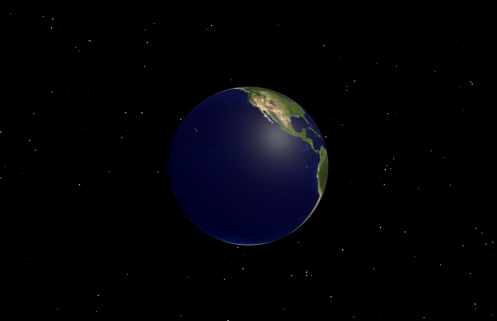
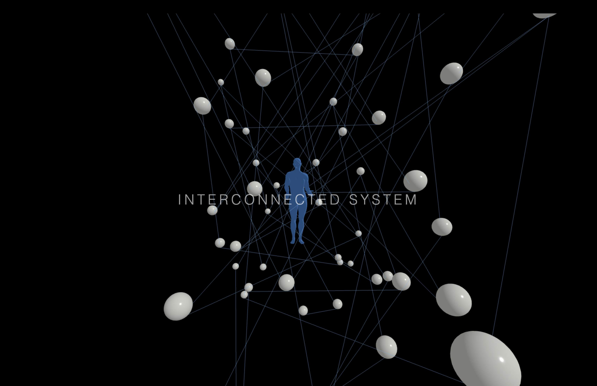
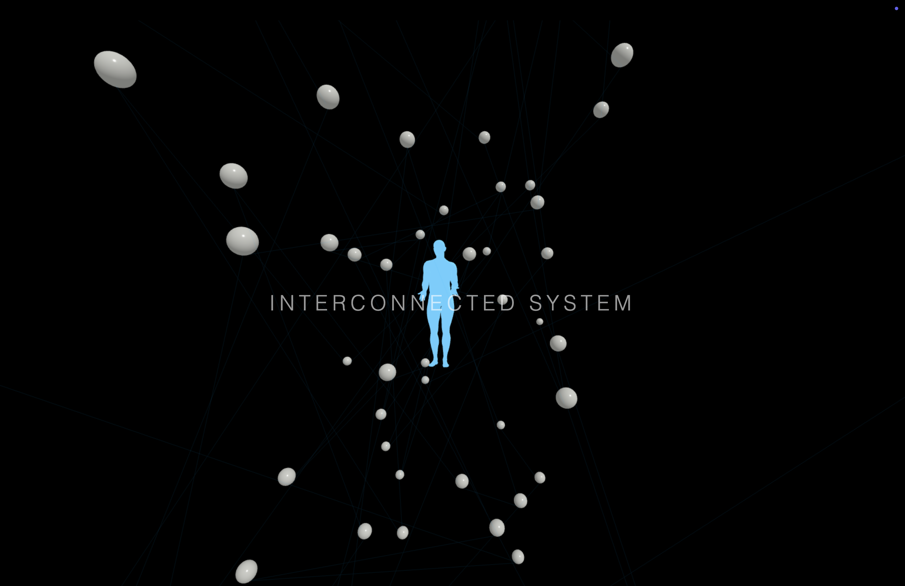
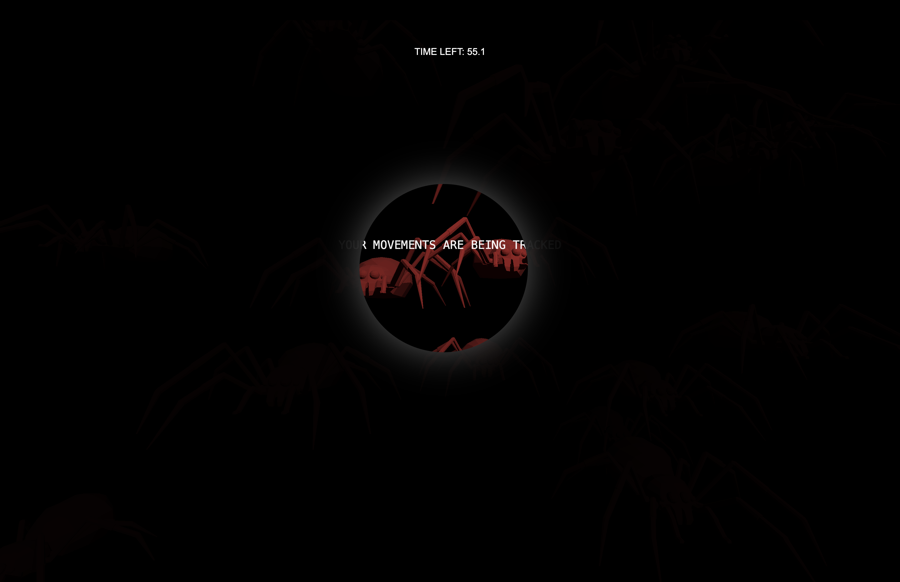

# CART-263-PROJECT-II
Cart 263 project II
- Team work : Xueyi Xia, Weini Wang
- github live link：https://github.com/xiaxueyi00-eng/cart263-Project2
- github repositories link：

# Interactive Web Project
Project Overview
- This project discusses the digital network paradox: the internet is usually understood as a tool to connect and share space, but at the same time, it is also a system of continuous data collection, control and the constructs of visibility.
- Based on the foundation of Project I, this project continues the original conceptual framework, and further expands the mode for expression through a more spatial and interactive web structure. The project's core structure does not change, but by adding a more comolex interactive mechanism and partial three-dimensional representation, the network system becomes more audiovisual and immersive.
# Structure of the Project
- The project consists of six interconnected webpages:

# Xueyi Xia Part:
1. Page One: EARTH
- This page is the entrance to the whole project, constructing a 3D interactive space centered on a globe model. When users enter this page, they first see a suspended Earth model in a universe background. This model is built using Three.Js and combined with a 2D start background to create a multi-layered visual space. The page background is created using Canvas. The stars move continuously downward, simulating a sense of flowing space and reinforcing the visual idea of an infinitely expanding digital space. 

2. Page Two: SHARED
- This page continues the exploration of digital network structures, constructing a three-dimensional interactive system centered on a human model. When users enter this page, they first see a human model suspended in a black digital space, which is surrounded by multiple floating spherical nodes. These nodes are constructed using Three.js, forming a dynamic network structure used to represent data flow and relational organization within the digital environment. The sphere around the centre human model moves in orbital motion, forming a constantly circulate and an unstable visual state.
- Click the left side of the character to activate it, and the right side to move to the next page.

3. Page Three: SEEN
- This page is talking about the digital system ‘s control and hallucination. Users enter a dark immersive space, and the player’s vision is limited by a flashlight like spotlight effect; this symbolizes the limitations of information access. Narrative text begins to construct a sense of surveillance and control atmosphere, hinting that users are not in genuine control of this environment and are in a guided state.

# Weini Wang Part :

# References: