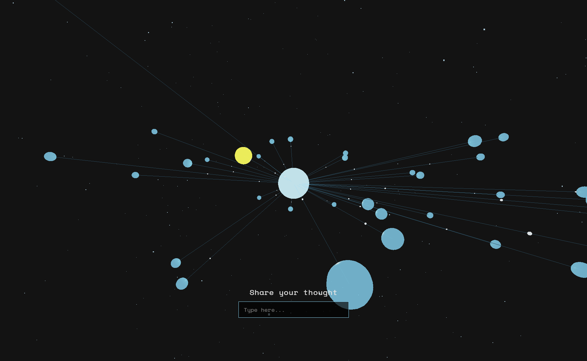
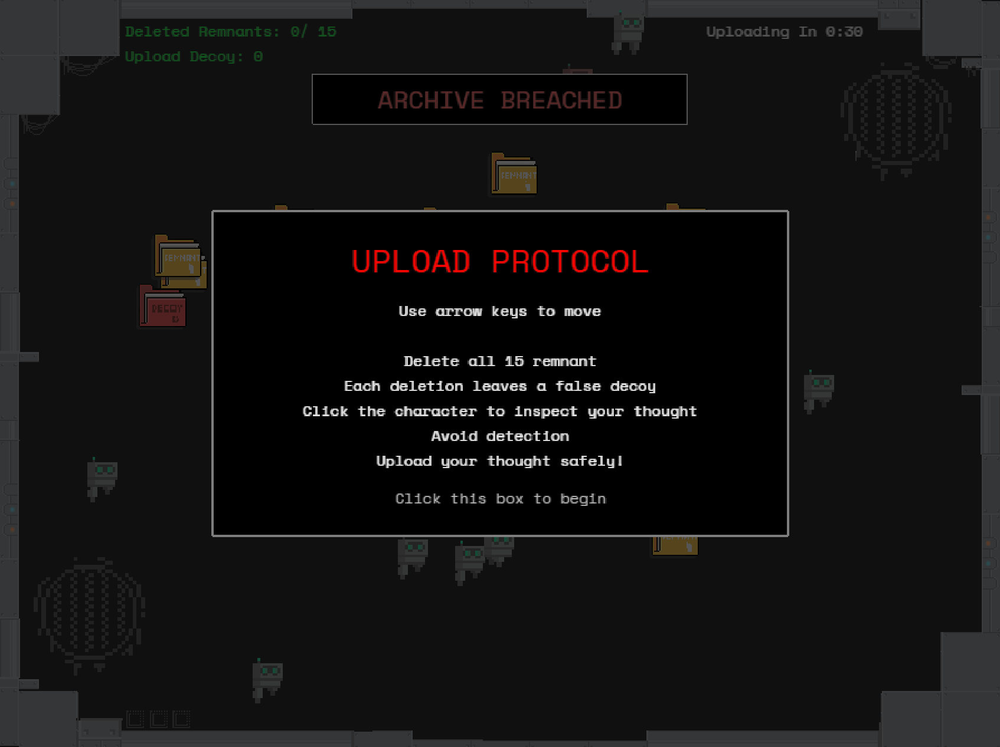
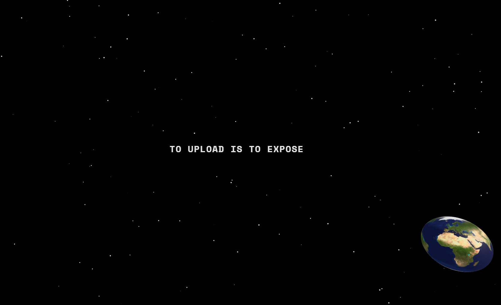

# CART-263-PROJECT-II
Cart 263 project II
- Team work : Xueyi Xia, Weini Wang
- github live link：https://xiaxueyi00-eng.github.io/cart263-Project2/Xueyi-Xia/html/index.html 
- github repositories link：https://github.com/xiaxueyi00-eng/cart263-Project2

# Interactive Web Project
Project Overview
- This project discusses the digital network paradox: the internet is usually understood as a tool to connect and share space, but at the same time, it is also a system of continuous data collection, control and the constructs of visibility.
- Based on the foundation of Project I, this project continues the original conceptual framework, and further expands the mode for expression through a more spatial and interactive web structure. The project's core structure does not change, but by adding a more complex interactive mechanism and partial three-dimensional representation, the network system becomes more audiovisual and immersive.
# Structure of the Project
- The project consists of six interconnected webpages:

# Xueyi Xia Part:
1. Page One: EARTH
- This page is the entrance to the whole project, constructing a 3D interactive space centered on a globe model. When users enter this page, they first see a suspended Earth model in a universe background. This model is built using Three.Js and combined with a 2D start background to create a multi-layered visual space. The page background is created using Canvas. The stars move continuously downward, simulating a sense of flowing space and reinforcing the visual idea of an infinitely expanding digital space. 

2. Page Two: SHARED
- This page continues the exploration of digital network structures, constructing a three-dimensional interactive system centered on a human model. When users enter this page, they first see a human model suspended in a black digital space, which is surrounded by multiple floating spherical nodes. These nodes are constructed using Three.js, forming a dynamic network structure used to represent data flow and relational organization within the digital environment. The sphere around the centre human model moves in orbital motion, forming a constantly circulate and an unstable visual state.
- Click the left side of the character to activate it, and the right side to move to the next page.

3. Page Three: SEEN
- This page is talking about the digital system ‘s control and hallucination. Users enter a dark immersive space, and the player’s vision is limited by a flashlight like spotlight effect; this symbolizes the limitations of information access. Narrative text begins to construct a sense of surveillance and control atmosphere, hinting that users are not in genuine control of this environment and are in a guided state.

# Weini Wang Part :

4. Page Four: SUMBIT
- This page is the entry page. It presents a 3D network made of a central sphere, surrounding nodes, connecting lines, and moving data flows. The user can hover over a node, click it, and type a shared thought. After pressing Enter, the selected node is absorbed into the center, suggesting that personal input becomes part of a larger system. This page uses Three.js for 3D geometry, raycasting, particle animation, and interaction.

5. Page Five: UPLOAD
- This page is the game page. The player moves through a surveillance space, collects and deletes traces, leaves decoys behind, avoids robots, and tries to reach the upload gate before being fully tracked. One robot actively hunts fake files, which turns decoys into a tactical mechanic rather than a purely visual effect. This page uses Phaser.js for movement, collision, enemy behavior, countdown timing, and branching endings.
- Use the arrow keys to move.

6. Page Six: WORLD
- This is the final page. A small Earth appears in a dark space. As the user clicks, it grows and moves to the corner, revealing a message. This page is not about connection, but about exposure. It shows that uploading a thought is never neutral. Every action becomes data.In the process of uploading, the user is also uploading their personal information.This page uses Three.js for the 3D Earth and animation.

# References:

Lund, Jonas. We See In Every Direction (2013).
https://jonaslund.com/works/we-see-in-every-direction/

Zuboff, S. (2019). 
The age of surveillance capitalism: The fight for a human future at the new frontier of power. PublicAffairs.
https://shoshanazuboff.com/book/

Gillespie, T. (2014). 
The relevance of algorithms. In T. Gillespie, P. J. Boczkowski, & K. A. Foot (Eds.), Media technologies: Essays on communication, materiality, and society (pp. 167–193). MIT Press.
 https://doi.org/10.7551/mitpress/9780262525374.003.0009

Blast Theory. Can You See Me Now? (2003) 
https://www.blasttheory.co.uk/projects/can-you-see-me-now/、

Please Empty Your Pockets (2010)
https://www.lozano-hemmer.com/please_empty_your_pockets.php

Character Templates Pack
https://erisesra.itch.io/character-templates-pack

16x16+ Robot Tileset
https://0x72.itch.io/16x16-robot-tileset

